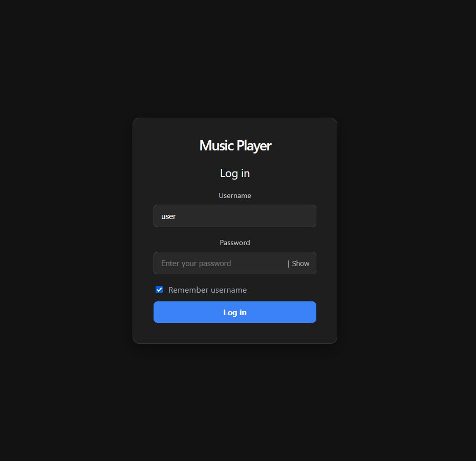
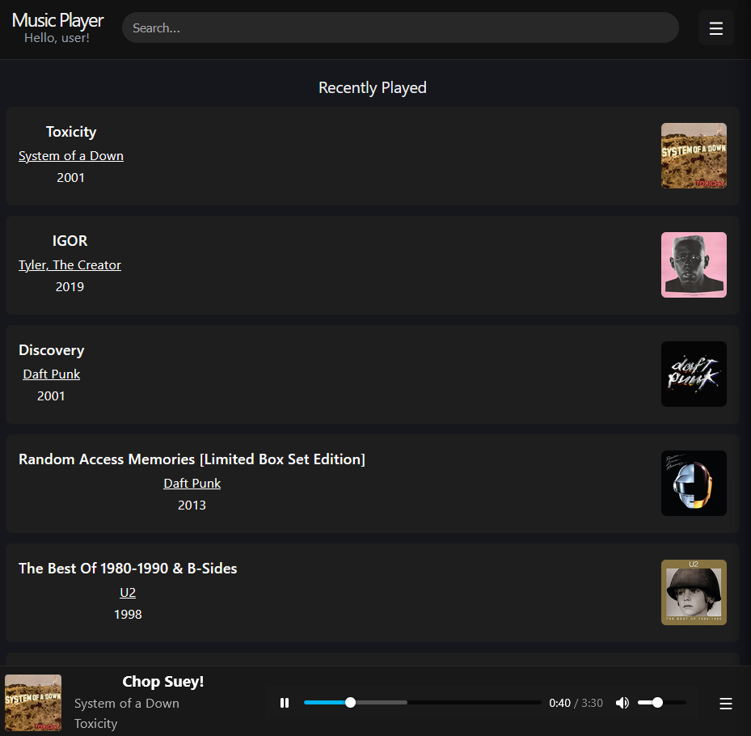
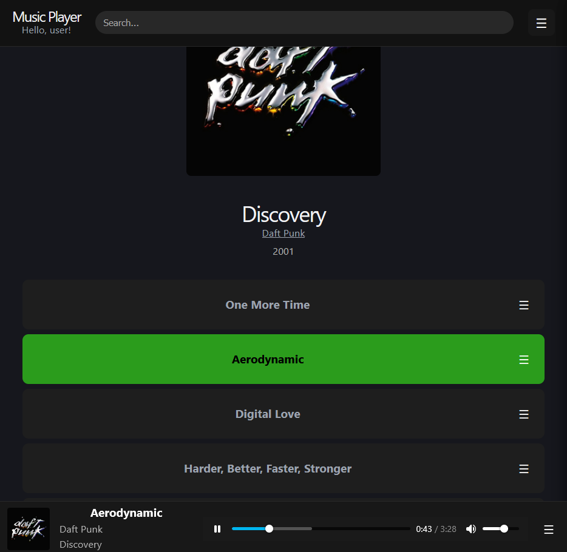
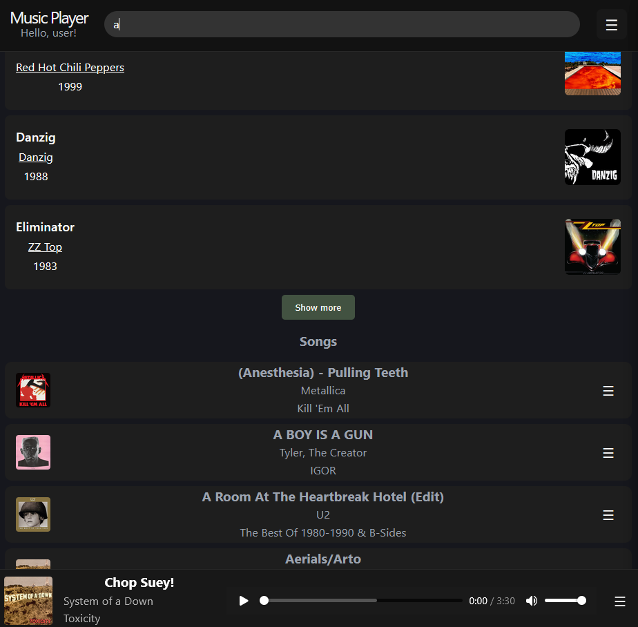
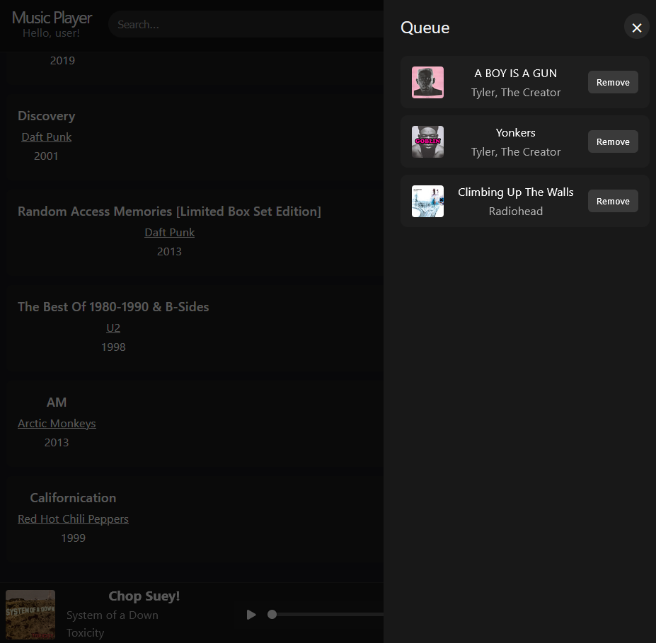

# Project
This project is made to be an easy to deploy self hosted web-based music streaming site with user authentication.


## Screenshots

<div align="center">
  <table>
    <tr>
      <td align="center"><b>Login</b><br></td>
      <td align="center"><b>Home</b><br></td>
      <td align="center"><b>Album</b><br></td>
    </tr>
    <tr>
      <td align="center"><b>Search</b><br></td>
      <td align="center"><b>Queue</b><br></td>
      <td align="center"></td>
    </tr>
  </table>
</div>

## Features
- User authentication
- Session timeout

### User features
- Last played albums
- Queue
- Music searching
- Album listening state to remember where the user left off


## Technical features
- Back end offset searching

### Data import
- Data import is currently run as a script with the user_id being 1 for authentication

#### Import structure
```bash
/res/ (configured in env)
├── album1/
│   ├── song1_file
│   ├── song2_file
│   └── cover_image_file
└── album2/
    ├── song1_file
    └── cover_image_file
```

### Supported file formats

#### Song files
- mp3, flac

#### Album covers
- jpg, jpeg, png, webp


## Technologies

### Front

- React
- TypeScript
- Vite
- CSS

### Back

- Node.js
- Fastify
- TypeScript
- Prisma
- PostgreSQL
- Argon2

## Project structure
```bash
.
├── back/
│   ├── prisma/
│   │   ├── migrations/
│   │   │   └── migration_files
│   │   └── schema
│   ├── scripts/
│   │   └── import_scripts
│   ├── src/
│   │   ├── hooks/
│   │   │   └── auth.ts
│   │   ├── lib/
│   │   │   └── prisma_client
│   │   └── routes/
│   │       └── api_rouets
│   ├── server.ts
│   ├── secure-session.d.ts
│   └── .env
├── front/
│   └── src/
│       ├── api/
│       │   └── api_call_functions
│       ├── components/
│       │   └── all_component_files
│       ├── hooks/
│       │   └── hook_files
│       ├── types/
│       │   └── types_for_song_artist_album
│       └── App.tsx
├── nginx/
│   └── nginx.conf
├── start.bat
└── start.sh
```

## Installation

### Requirements
- Node
- PostgreSQL
- Nginx

### Setting up
- clone repo
### Front

```bash
cd front
npm install
npm run build
```

### Back 

```bash
cd back
npm install
npx prisma migrate deploy
cp .env.example .env 
openssl rand -out secret-key 32 
```

### Configuration
- Configuration is made in the backend env file
- MAX_QUEUE_SIZE=5
- MAX_RECENT_ALBUMS=8
- REGISTER_OPEN=true
- SESSION_MAX_AGE=21600 (6 hours: 6 x 60 x 60 = 21600)

### Running
- to be completed


## Known limitations
- "/" on song filename corrupts the filepath
- "[space]" on album directory name corrupts the album cover path

## To be added
- Back end rate limiting
- Range requests for streaming
- User playlists


## License
Project is for educational/personal use only